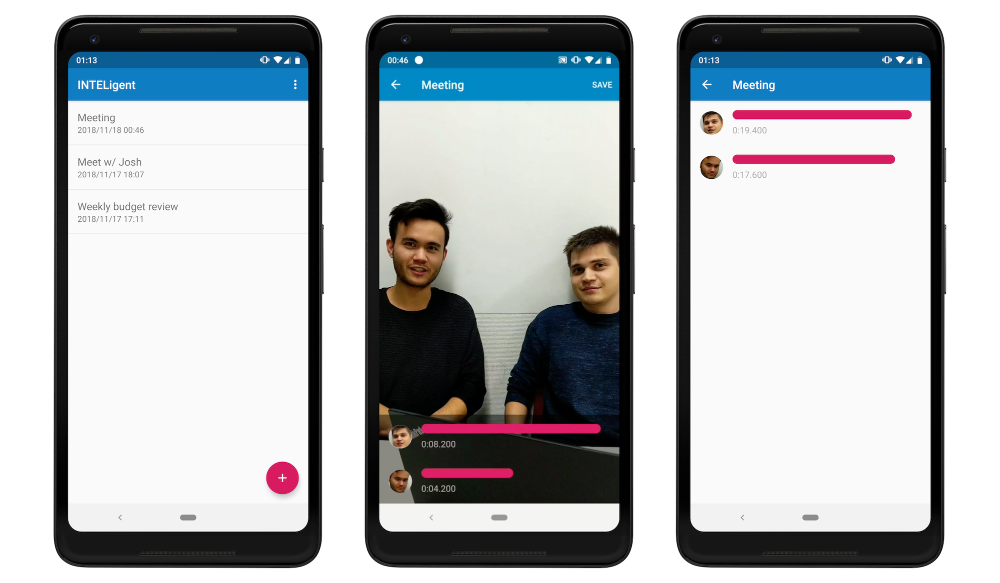

## INTELigent
### Winner of the Intel Smart Vision challenge at hackaTUM 2018

Research shows that women and others talk less and are interrupted more often in meetings. This has been presented [by Intel’s very own Beenish Zia and Nina Lane](http://blog.meeteor.com/blog/women-in-meetings/). The first step to solving this problem is to expose the data — which is what our hackathon project _INTELigent_ (yes, we like bad word plays) is designed to do.

At the _hackaTUM_ hackathon at TU Munich, we joined Intel’s Smart Vision challenge and created an application that aims to create more balanced meetings. It records meetings via a stationary camera and uses computer vision to understand when any particular person is talking. Then, it creates a timeline that provides insights into the distribution of talking time.

### How it works

Our app streams the video of the meeting to a Python server, where a custom-built image processing pipeline extracts all faces, performs re-identification and then estimates whether any particular person is currently talking based on their facial landmarks. We use a basic approach where we assume that if the mouth of a person is open, this person is likely to be talking right now. 

The processing pipeline uses [Intel’s OpenVINO](https://software.intel.com/en-us/openvino-toolkit) for face detection as well as [OpenCV](https://opencv.org/) for re-identification and landmark detection.

### Future enhancements

With the raw data that our app already records, we can provide many more insights into many various aspects of disparity in meetings: how often women are cut off prematurely, whether the team lead is using the meeting mostly for self promotion, or if the junior team member ever gets the chance to say a word. This can be achieved by not only looking at the time spent talking, but by analyzing things such as posture, body language and emotion. We believe that with this data, companies can become a more open and collaborative environment for everyone.

### Team
- [Jonathan Rösner](https://github.com/joroGER)
- [Joshua Arnold](https://github.com/JoshAr)
- [Karim Wolfsteller](https://github.com/Jargolino)
- [Lukas Streit](https://github.com/lukasstreit)
- [Till Hellmund](https://github.com/thellmund)
